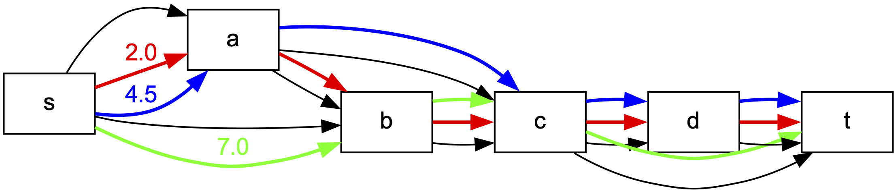

Flowpaths implements various helper functions on graphs. They can be access with the prefix `flowpaths.utils.`

For example, you can create drawing as this one



using the following code:

``` python 
import flowpaths as fp
import networkx as nx

# Create a simple graph
graph = nx.DiGraph()
graph.graph["id"] = "simple_graph"
graph.add_edge("s", "a", flow=6)
graph.add_edge("s", "b", flow=7)
graph.add_edge("a", "b", flow=2)
graph.add_edge("a", "c", flow=5)
graph.add_edge("b", "c", flow=9)
graph.add_edge("c", "d", flow=6)
graph.add_edge("c", "t", flow=7)
graph.add_edge("d", "t", flow=6)

# Solve the minimum path error model
mpe_model = fp.kMinPathError(graph, flow_attr="flow", k=3, weight_type=float)
mpe_model.solve()

# Draw the solution
if mpe_model.is_solved():
    solution = mpe_model.get_solution()
    fp.utils.draw_solution(
        G=graph,
        filename="simple_graph.pdf",
        flow_attr="flow",
        paths=solution["paths"],
        weights=solution["weights"],
        draw_options={
        "show_graph_edges": True,
        "show_edge_weights": False,
        "show_path_weights": False,
        "show_path_weight_on_first_edge": True,
        "pathwidth": 2,
    })
```

This produces a file with extension `.pdf` storing the PDF image of the graph.

::: flowpaths.utils.graphutils