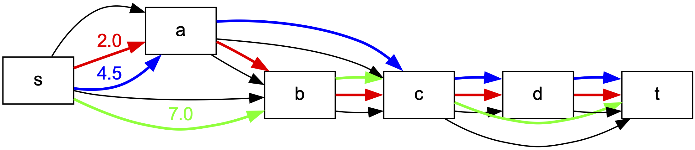
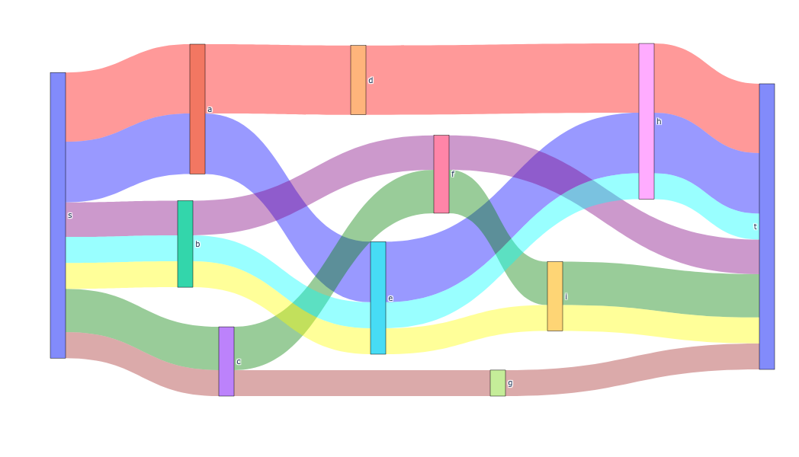

Flowpaths implements various helper functions on graphs. They can be access with the prefix `flowpaths.utils.`

## Graph visualization and drawing

You can create drawing as this one



using the following code:

``` python 
import flowpaths as fp
import networkx as nx

# Create a simple graph
graph = nx.DiGraph()
graph.graph["id"] = "simple_graph"
graph.add_edge("s", "a", flow=6)
graph.add_edge("s", "b", flow=7)
graph.add_edge("a", "b", flow=2)
graph.add_edge("a", "c", flow=5)
graph.add_edge("b", "c", flow=9)
graph.add_edge("c", "d", flow=6)
graph.add_edge("c", "t", flow=7)
graph.add_edge("d", "t", flow=6)

# Solve the minimum path error model
mpe_model = fp.kMinPathError(graph, flow_attr="flow", k=3, weight_type=float)
mpe_model.solve()

# Draw the solution
if mpe_model.is_solved():
    solution = mpe_model.get_solution()
    fp.utils.draw(
        G=graph,
        filename="simple_graph.pdf",
        flow_attr="flow",
        paths=solution["paths"],
        weights=solution["weights"],
        draw_options={
        "show_graph_edges": True,
        "show_edge_weights": False,
        "show_path_weights": False,
        "show_path_weight_on_first_edge": True,
        "pathwidth": 2,
    })
```

This produces a file with extension `.pdf` storing the PDF image of the graph.

### Sankey Diagram Visualization

For acyclic graphs (DAGs), you can create interactive Sankey diagrams using plotly. Sankey diagrams are particularly effective for visualizing flow decompositions, as they show:

- Each node in the graph as a labeled box
- Each path as a colored flow whose width represents the path weight



To create a Sankey diagram, set `"style": "sankey"` in the `draw_options`:

```python
import flowpaths as fp
import networkx as nx

# Create a sample DAG
G = nx.DiGraph()
G.add_edge('s', 'a', flow=10)
G.add_edge('s', 'b', flow=5)
G.add_edge('a', 'c', flow=6)
G.add_edge('a', 'd', flow=4)
G.add_edge('b', 'c', flow=3)
G.add_edge('b', 'd', flow=2)
G.add_edge('c', 't', flow=9)
G.add_edge('d', 't', flow=6)

# Compute minimum flow decomposition
solver = fp.MinFlowDecomp(G, flow_attr='flow')
solver.solve()
solution = solver.get_solution()

# Draw as interactive Sankey diagram
fp.utils.draw(
    G=G,
    filename="flow_sankey.html",  # saves as HTML (interactive)
    flow_attr='flow',
    paths=solution['paths'],
    weights=solution['weights'],
    draw_options={
        "style": "sankey"
    }
)
```

**Features:**

- **Interactive:** Hover over nodes and links to see details, zoom and pan the diagram
- **Jupyter support:** Automatically displays inline when run in Jupyter notebooks
- **Dual output:** Automatically saves both HTML (interactive) and a static image (PDF by default)
- **Automatic coloring:** Each path gets a distinct color; shared edges show blended colors
- **Graph identification:** Uses the graph's ID as the diagram title if available

**Requirements:**

- **plotly:** Installed automatically with flowpaths
- **kaleido:** Installed automatically with flowpaths for static image export

**File formats:**

The function automatically saves both formats:
- HTML file (interactive): `[basename].html`
- Static image: `[basename].pdf` (or .png, .svg if specified)

```python
# Saves both output.html and output.pdf
fp.utils.draw(G, "output", paths=paths, weights=weights, 
              draw_options={"style": "sankey"})

# Saves both flow.html and flow.png
fp.utils.draw(G, "flow.png", paths=paths, weights=weights,
              draw_options={"style": "sankey"})

# Saves both diagram.html and diagram.svg
fp.utils.draw(G, "diagram.svg", paths=paths, weights=weights,
              draw_options={"style": "sankey"})
```

**Note:** Sankey diagrams require the graph to be acyclic (DAG). If the graph contains cycles, use the traditional graphviz rendering (`"style": "default"` or `"style": "points"`).

See [examples/sankey_demo.py](https://github.com/algbio/flowpaths/blob/main/examples/sankey_demo.py) and [examples/sankey_demo.ipynb](https://github.com/algbio/flowpaths/blob/main/examples/sankey_demo.ipynb) for complete examples.

## Logging

flowpaths exposes a simple logging helper via `fp.utils.configure_logging`. Use it to control verbosity, enable console/file logging, and set file mode.

Basic usage (console logging at INFO level):

```python
import flowpaths as fp

fp.utils.configure_logging(
    level=fp.utils.logging.INFO,
    log_to_console=True,
)
```

Also log to a file (append mode):

```python
fp.utils.configure_logging(
    level=fp.utils.logging.DEBUG,      # default is DEBUG
    log_to_console=True,               # show logs in terminal
    log_file="flowpaths.log",         # write logs to this file
    file_mode="a",                    # "a" append (or "w" overwrite)
)
```

Notes:
- Levels available: `fp.utils.logging.DEBUG`, `INFO`, `WARNING`, `ERROR`, `CRITICAL`.
- Default level is DEBUG. If you prefer quieter output, use INFO or WARNING.
- Internally, the package logs through its own logger; `configure_logging` sets handlers/formatters accordingly.

API reference:

::: flowpaths.utils.logging.configure_logging

---

::: flowpaths.utils.graphutils